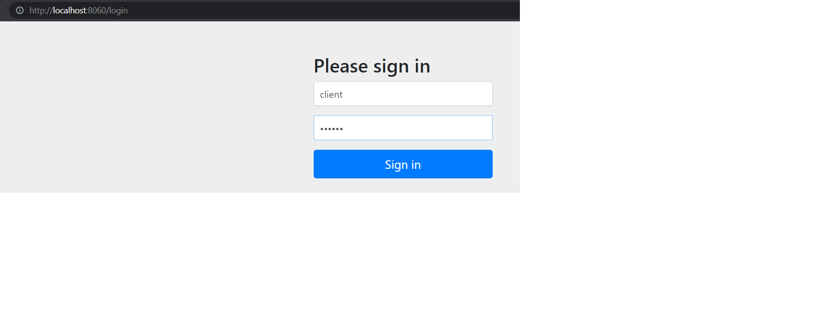
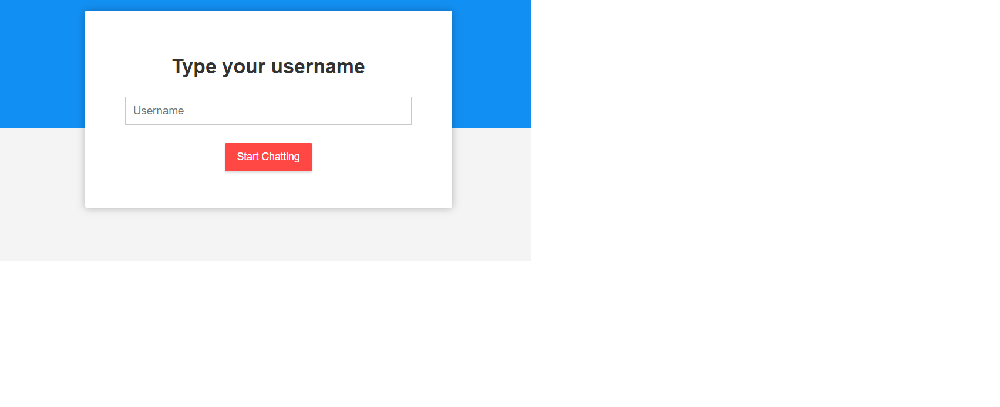
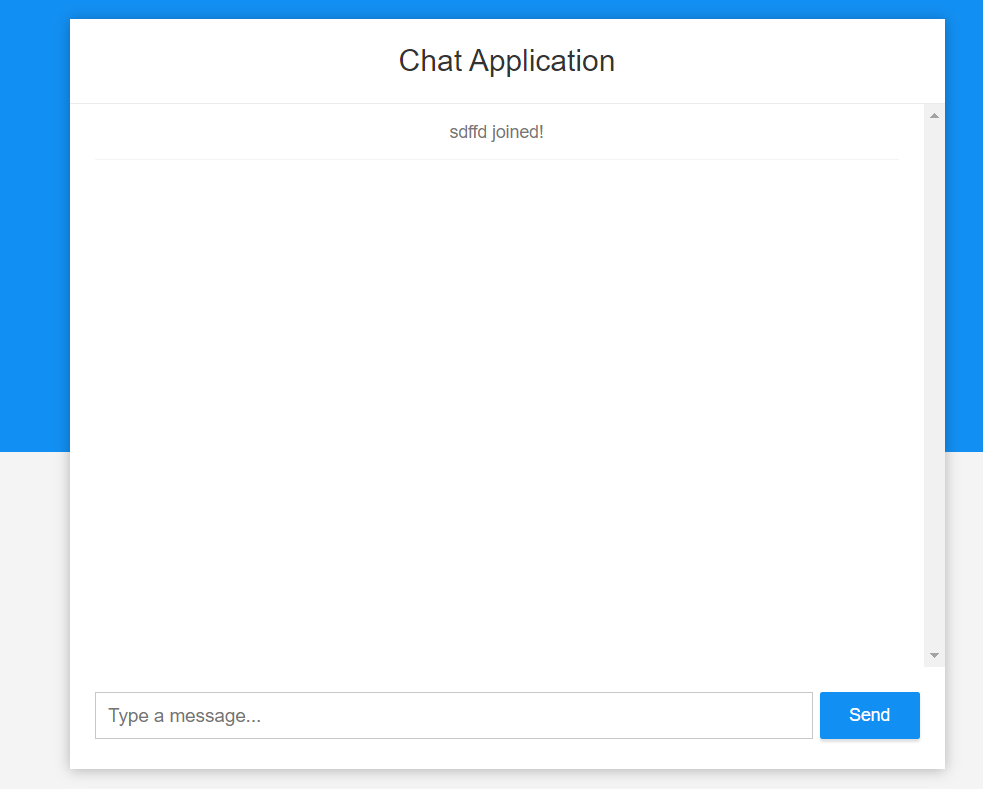
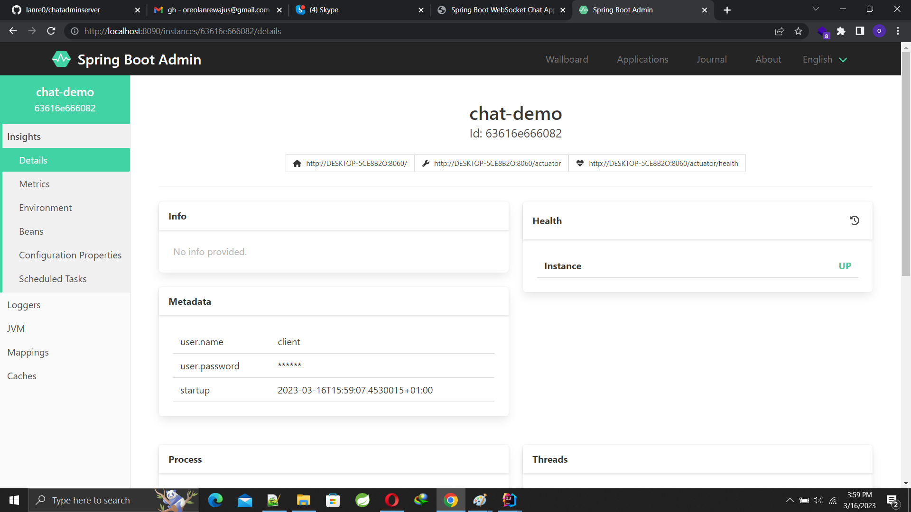

# client server rest api chat system

```What is required```
1. Java 11
2. Spring Boot Cloud and Dependencies
3. Spring Boot Admin Service


```Source Code```

This repository contains the source code for all the chat admin server application. Containing two applications


### 1.server

An application that listens to other applications and gather metrics 


### 2.chat-demo

A multi user chat application and a client to the server  


```All these projects are maven based.```

You can run the project by following these steps:

```Building the Project```

To build these mavens based projects,run the following command: mvn clean install

```Running Spring Boot Project```

To run a Spring Boot module run the command: 

``mvn spring-boot:run`` 

``Running Java Project``

Start by running the server application that is configure to port 8090
open http://localhost:8090/ on browser


Run chat-demo configured to port 8060
open http://localhost:8060/ on browser





make use of credentials below for admin server

username=client

password=client


The main chat window open 

login with a chat user



Multiple windows can be opened and different chat username can be used to simulate chatting process



on http://localhost:8090/ the metrics can be monitored




